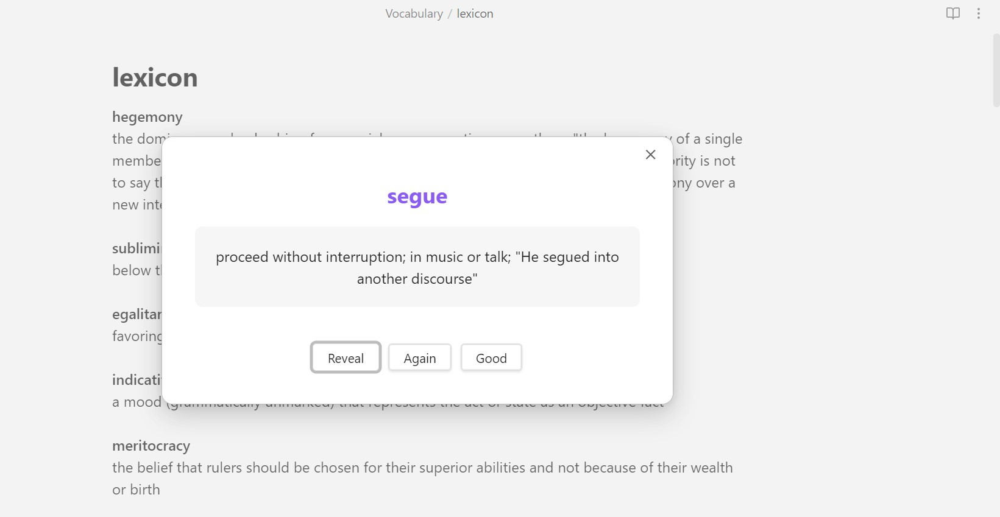
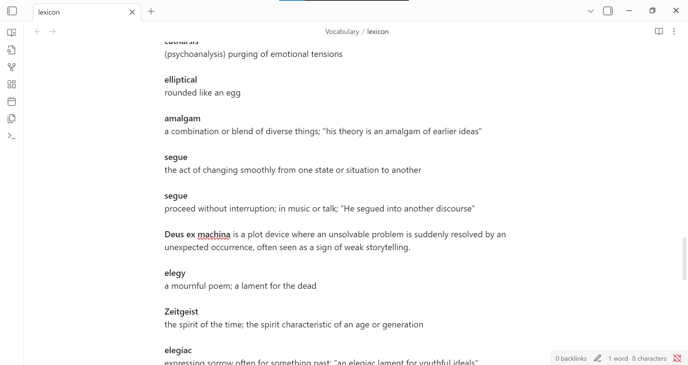
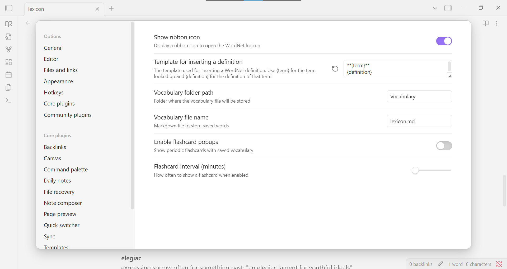

# Dictionary Lexicon Plugin for Obsidian

A powerful dictionary plugin for Obsidian that provides WordNet definitions, vocabulary management, and spaced repetition flashcards to help improve your vocabulary.

## Features

- **WordNet Dictionary Lookup**: Search and insert definitions from the comprehensive WordNet database
- **Vocabulary Management**: Save words and definitions to a dedicated vocabulary file
- **Flashcard System**: Review your vocabulary with periodic flashcard popups
- **Context Menu Integration**: Right-click to look up or save selected text
- **Customizable Templates**: Define how definitions are inserted into your notes

## Screenshots

Add these images under `docs/screenshots/` (or your preferred path), then update the links below:

- **Overview**
  
  

- **Lookup modal** (searching and inserting definitions)
  
  

- **Vocabulary file** (saved words and definitions)
  
  

- **Settings** (display, templates, vocabulary, flashcards)
  
  


## Installation

### From Obsidian Community Plugins
1. Open Settings → Community Plugins
2. Search for "Dictionary Lexicon"
3. Click Install and then Enable

### Manual Installation
1. Download the latest release from GitHub
2. Extract the files into your vault's `.obsidian/plugins/obsidian-lexicon-dictionary-plugin/` folder
3. Reload Obsidian
4. Enable the plugin in Settings → Community Plugins

## Usage

### Looking Up Words
- **Ribbon Icon**: Click the book icon in the left ribbon
- **Command Palette**: Use "Dictionary Lexicon: Look up a word"
- **Context Menu**: Right-click on any word and select "Look up selection"
- **Auto-detect**: Open the lookup with no selection to detect the word under cursor

### Saving Vocabulary
- Click "Save" button in the lookup results
- Right-click and select "Add selection to vocabulary"
- Use command "Dictionary Lexicon: Add selection to vocabulary"

### Flashcards
- Enable automatic flashcards in settings
- Or manually trigger with "Dictionary Lexicon: Open vocabulary flashcard"
- Review saved vocabulary with spaced repetition

## Settings

### Display Options
- **Show ribbon icon**: Toggle the dictionary icon in the left ribbon

### Templates
- **Definition template**: Customize how definitions are inserted
  - Use `{term}` for the word
  - Use `{definition}` for the definition
  - Default: `**{term}**\n{definition}\n`

### Vocabulary
- **Folder path**: Where to store vocabulary file (default: `Vocabulary`)
- **File name**: Name of vocabulary file (default: `lexicon.md`)

### Flashcards
- **Enable automatic popups**: Show periodic flashcards
- **Interval**: How often to show flashcards (5-240 minutes)

## Development

### Project Structure
```
obsidian-lexicon-dictionary-plugin/
  main.ts                    # Plugin entry point
  types.ts                   # TypeScript interfaces
  constant.ts                # Constants and configuration
  DictionaryService.ts        # WordNet dictionary service
  VocabularyManager.ts       # Vocabulary management
  DictionarySuggester.ts     # Search suggestions UI
  FlashCardModal.ts          # Flashcard modal component
  SettingsTab.ts             # Settings interface
  styles.css                 # Plugin styles
  manifest.json              # Plugin manifest
```

### Building from Source
```bash
# Install dependencies
npm install

# Development build with watch mode
npm run dev

# Production build
npm run build
```

### Contributing
Contributions are welcome! Please:
1. Fork the repository
2. Create a feature branch
3. Make your changes
4. Submit a pull request

## License

MIT License - see LICENSE file for details

## Credits

- **WordNet Dictionary Data**: This plugin uses WordNet® lexical database from Princeton University
- **Author**: Alvin ([GitHub](https://github.com/st-vin/lexicon-dictionary))
- Built for the Obsidian community

## WordNet Citation

This plugin uses WordNet® lexical database.

**For online references:**
- Princeton University "About WordNet." WordNet. Princeton University. 2010.

WordNet® is a registered tradename of Princeton University. The WordNet database is made available under the terms of Princeton University's license.

## Support

If you encounter issues or have suggestions:
- Open an issue on [GitHub](https://github.com/st-vin/obsidian-lexicon-dictionary-plugin)
- Contact the developer